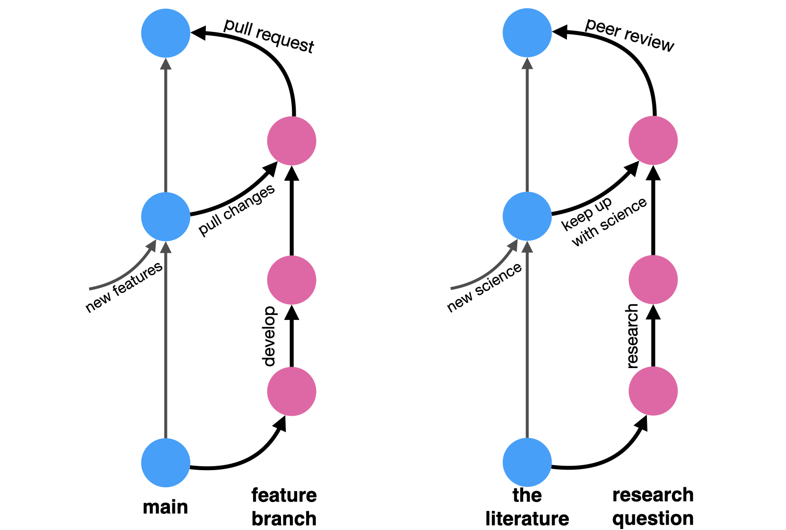

Research is becoming more and more quantitative, and quantitative results are now generated almost exclusively by code. 
Scientists are now coders, regardless of whether they regard themselves as such or not. 
And in a reality where science becomes inseparable from coding, code becomes king, and it should be treated as such.

As a computer scientist and data scientist, I have been synthesizing software engineering practices into research practices for nearly a decade now. 
As an industry researcher, I have onboarded dozens of academics into tech industry standards, and mentored a dozen more students and interns to espouse software development frameworks to their research conduct.

During this experience, I got questioned (not to say pushed back) and got to argue much for, among others, this Research-Software hybrid, 
which I often call "Clean Code for research code" as an umbrella term for good software development practices for research. 
This umbrella lifts heavy because I mix software development tools, approaches, and mental models.
This article is, however, not a full manifesto, but some scattered thoughts on the topic.

<!-- This article will hopefully lay the case for incorporating software development tools and mental models into research. -->

### Better code builds better trust
When in a restaurant, kitchen hygiene is directly related to your trust levels, because food is made in this kitchen.
When in a lab, bench order is directly related to your trust levels, because results are made on this bench.
A disorganized bench induces less trust because there are fewer guardrails against human mistakes --- mistakes that are often avoided by consistent and disciplined work --- and therefore less guarantees that results are sound.
By the same principles, when doing quantitative research, it's the data organization and code quality that directly relate to your trust levels --- A well-organized digital bench is the equivalent of a physical bench. 

Nowadays, when science is produced with code, our trust levels should directly correlate with code quality. 
Therefore, if you're too embarrassed to publish your code, you should probably be too embarrassed to publish the results generated by it.

<!-- [^1]: Similar to if you're too embarrassed to show people the state of your kitchen, you should be too embarrassed to serve them the food made in it. -->

### Better code makes a better future you

#### Reusability

Research is often erratic and quick paced. 
Projects are rarely properly finalized before we jump to the next one (or two). 
Other than earned experience, what tangible assets do we carry with us moving from one project to the other?
How do we ensure we made the most out of our time and effort on each project?
Or feel like we at least got something from an annoying/boring one?

I'd argue code is a great thing to accumulate along your research path.
Analyses have many overlapping parts across projects. 
Domains don't rapidly change, data is reused, certain fields have high affinity for certain methods.

Extracting core functionalities and reusing them can save future you a lot of effort and time.
Time you could otherwise spend to go further or dive deeper into the subject[^3].

Extracting reusable functionality requires code encapsulation; well-defined tasks with properly-generalized inputs and outputs, clearly documented and clearly named; good parameterization and magic-number avoidance[^4]...
You know, the things that make code better. 

[^3]: or into the pool. No judgment whatsoever here. 

[^4]: They are unlikely to generalized to your next project.

#### Documentation
We've all been a stranger to code we wrote 6 days/weeks/months ago and haven't touched since.
Advice is often to document by commenting alongside the code.
But comments can become detached from code and only increase future confusion.
It's not that they are bad, there might just be better approaches to supplement it.

Going back to reusability - simpler functions are easier to document.
<!-- Breaking down functions to simpler components -- smaller in size and with higher cohesion -- that perform well-defined tasks
make it easier to understand code when reading it. -->
Breaking down functions to simpler and smaller components makes it easier to understand the code when reading it.
High-cohesion components performing well-defined tasks are more likely to be self-documenting, 
preventing the potential drift between code and documentation.

Comments that explain *what* a code portion does should be function names.
Comments that explain *why* code was implemented in a certain way are better, 
but they don't have to be code comments - they can be Git commit messages. 
Documenting rationale in Git commits not only declutters the actual code, but also makes the code inseparable from its corresponding comment. 
Comments will forever be attached to their true code as long as version control is there.

Furthermore, using Git with good-titled commit messages allows you to skim through the log of everything you've done and refresh your memory better, as it follows your original research journey. 
We remember stories with context better than isolated comments.
More on that later.

#### Caring (about code) is sharing
Well-documented reusable code is also more shareable code. 
Being a stranger to your own code is equivalent to being a stranger to a stranger's code.
And you can be that stranger. 

Properly encapsulated code allows you to treat and use code as a black box.
It doesn't matter whether you wrote it and forgot the internal mechanism, or you didn't write it and know nothing about the internal implementation.
As long as it has a clear contract specifying inputs and outputs, you can use it[^5].

[^5]: but do double check it if you don't trust it. 

This is what open-source software you use does. 
You can be your own open-source code, 
which allows you to be others' open-source code. 

This can make you a better lab mate, colleague, and peer.
And it can be done headache-free if done properly.
A good shareable analysis is so encapsulated, versioned, and documented that it should run with *no* input from you.
A good shareable analysis is decomposed into small well-defined components that can be expanded, tweaked, and tinkered with little input from you. 
A good shareable code can make you awesome and minimize nuisance.

:::{.callout-tip appearance="simple"}
## Quick summary
Next time you work on a research project, think what components can you carry from this project to your next one. 
Find them, clean them, make sure their inputs and outputs are clear and isolated/generic, then document them and test them. 
This is now a new tool in your toolbox.
You may now share it. Or not. 
But use the time you saved from rewriting/reimplementing it to expand something else deeper or further that you otherwise wouldn't.
:::

### Better code for better research derivatives
We're no longer in the 18th century.
Articles are not enough. 
Knowledge deserves better than being inked on dead wood.
<!-- Knowledge is assimilated better when not just inked on dead wood. -->
It is also assimilated far better when it moves beyond a static page. 

Have you made something innovative? make it easily accessible to others.
A new method, for example, is useless without some basic code implementation.
Nobody is going to implement the algorithm you typed in Latex.
No one will use it. 
And your hard work was done for nothing.
Zero impact. 
You want people to use your work? make it usable. 

Did you discover something new? show how you made it. 
Let others see your analysis or your simulations. 
Make it easier for them to verify you. 
If you want their citations, you need their trust;
and trust is gained through transparency.
Share code that is clear enough so others can understand what you did.

Want to go beyond 18th century publication practices?
How about an interactive report?  An app? A dashboard?
Those can only be supported by better code.
Code with clear inputs and outputs, in which your method clearly interfaces with the frontend framework. 

All of the above require sharing code. 
Sharing good code.
Well-structured and documented code that can be interacted with,
by both people who want to use it or software frameworks which need to present it.
The academic publication system is outdated and broken, but good coding practices can get you beyond its limitations.

### Better code tells better stories
Git is goddamn great.

Everyone should use Git. 
Heck, everyone would *want* to use Git, only if it had a friendlier interface for the masses.

In fact, everyone already wants to use Git.
People seem to be deeply aware of the benefits of version control. 
People use version control on Google Docs all the time. 
Git is just a way to make each version meaningful. 
A precise logger, rather than the bloated time-based or auto-detecting-write-bursts of automated version history. 
<!-- and I believe it is a major driver of why we connect our computers to the cloud. We seem deeply aware of the benefits of backup and version control.  -->

Working with git is multifaceted. 
On a practical level, git provides version control. 
No more `data_analysis-3-with_regression.py` or `manuscript-v6-prof_comments-latest_FINALFINAL.docx`, 
but a single script, data, manuscript, tracked through time. 
Wants an older version? extract it from the history [^2].
Not ready to commit to your current angle? run it on a branch first (makes it easier to discard). 
An intermediate version ready for co-author feedback? tag it.
Made a mistake? revert the commit.

[^2]: Where exactly? your commit messages will guide your sifting.

Even without the uninviting user interface, the learning curve of git is not easy. 
Learning habits never is. 
I worked hard on well-encapsulated commits with well-titled messages, or branching out and pull-requesting (even when working solo).
But once I put the work through the learning curve, I learned Git is not just a useful tool - it's a powerful mental model for organizing research progress. 

Messy threads of thought became branches, and threading them together became merge operations. 

Not to mention, writing academic articles is always hard to learn.
People, including me, are always drawn towards describing their experience ("I did this and then I did that" type of writing),
rather than describing what is relevant for the final set of results and their conclusions. 
This type of writing confuses research logs (or diaries) with academic reports. 
The nice thing about using Git flow to track your research flow, is that, if done properly, at the end, your Git log should read exactly as the story of your research.
Your research journey captured through the Git graph.

## Summary
Good coding practices, tools from software development, and mental models from software engineering can all make any quantitative researcher better, regardless of their domain. 
Good coding practices support sharing and build both trust and communities around your work.
It makes it easier for others --- including future you! --- to build on top of your earlier work.
It can also make it easier for present-you to organize your materials and thinking through the process of research.
You should check it out --- find a test project and checkout. 

<!-- Industry research moves fast and these practices, especially considering the learning curve, can raise legitimate concerns of cost-to-value tradeoffs.  -->

## Appendix {.appendix}
I wanted to keep it short, so kept a single focus on best software practices for research practices.
But there are other places where software development concepts meet research practices.
Two of which that I endorse are mappings between academic workflows to Git workflows and test-driven statistical modeling.

### Git workflows as academic workflows {.appendix}
In its simplest form, a Git workflow works as such: you start off a main branch holding the current state of your code. 
You then branch out to work on a specific well-described feature.
As you work on it, your teammates might introduce changes to the main branch, 
so you occasionally pull these updates into your feature branch to make sure your work is still compatible with the main code.
When done, you open a pull request, asking your teammates to review your changes and provide comments and feedback. 
It's an iterative process of refinement.
Once accepted, your proposed changes are merged back into the main branch.

Now replace:

* "main code" with "body of knowledge", 
* "feature branch" with "research question", 
* "pulling changes into your branch" with "reading new materials published while you work" 
  * (did you get scooped? rebuked? did you find something useful?), 
* "pull request" with "peer review", and 
* "merging to main" with "publishing your article". 

And there you have it, the ideal spherical cow of academic workflow in a nutshell: 
you start off from the known body of academic knowledge, chasing a research idea. 
You tinker with it, you do math, and code simulations, and write, and draw. 
You read relevant literature to incorporate into your research.
And once done, you take your draft to your peers to review, and they give you comments and feedback on how to improve your work.
And once that's done too, your article is published and is officially part of that body of academic knowledge you started from. 

### Test-driven statistical modeling {.appendix}
There are two test-driven designs you can apply to quantitative research that I picked up from years of coding both analyses and tools (or methods).

Developing statistical methods and tools requires an additional aspect on top of the vanilla test-driven development paradigm. 
In statistical models, we combine both deterministic and nondeterministic procedures.
The deterministic ones are all the data-wrangling a statistical procedure requires, or the post-processing required to present it.
These can be tested using good old unit-tests. 
The nondeterministic procedures are all the optimization procedures required for fitting statistical models, which are more often than not at least somewhat stochastic.
These require a slightly more elaborate scheme that resembles integration tests more than unit-tests.
They are more end-to-end, and they require us to think "what it means for a \<INSERT STATISTICAL MODEL\> to 'work properly'". 
If you ever find yourself publishing methods, you should think about that --- are there cases where results are known that you can further leverage to build trust with your users (including, first and foremost, yourself)?

While tooling-development is the more straightforward case for test-driven development, test-driven development is also relevant in coding analyses that *apply* statistical tools.
How can you ensure your workflow is coded properly and is free of bugs[^6]?
Here, a very powerful tool is coming up with synthetic data in which you know what the true parameters are and then see if your analytical pipeline recovers them. 

[^6]: and I'm assuming all the 3rd-party components you use are bug-free because they read the previous paragraph about testing for methods development. 

I know it all seems like a hassle, but testing actually provides freedom. 
Freedom to experiment and still be anchored. 
Like the cord that allows you to bungee jump with peace of mind. 
Testing allows you to move fast and break things, because they alert you when you broke something and give you a chance to fix it. 
It's a beacon that lets you know you're ok amidst the heavy fog of research. 
Well, at least assuming your tests are comprehensive enough, of course. 

 <!-- 
 Git for research:
 1. git is good
 version control.
 backup. 
 2. git workflow for research workflow
 mental model for research
 3. git workflow as academic workflow 
 -->