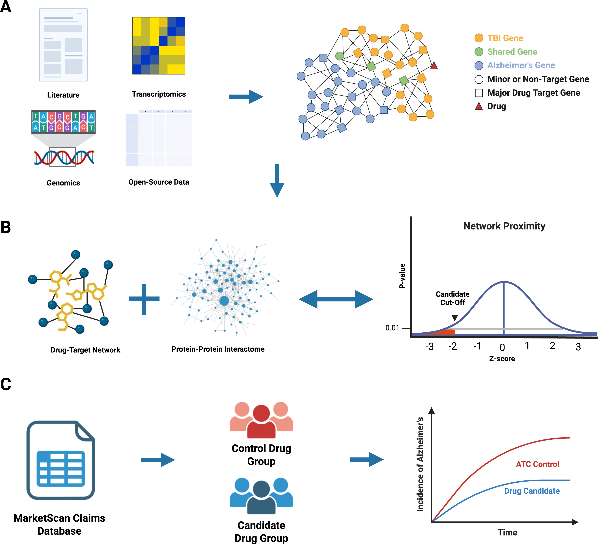
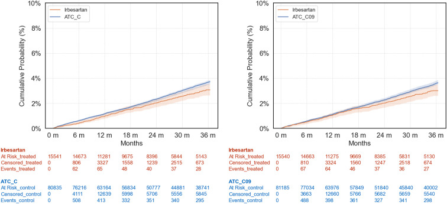

<!-- :::{.column-page} -->

<!-- ::: -->


## Citation
```bibtex
@article{bykova2026network,
  title={Network-based prediction and real-world patient data observation identify doxycycline as a repurposable drug in Alzheimer's disease},
  author={Bykova, Marina and Karavani, Ehud and Danziger, Michael and Tonegawa-Kuji, Reina and Martin, William and Sha, Zhendong and Pieper, Andrew A and Rosen-Zvi, Michal and Cheng, Feixiong},
  journal={Neurotherapeutics},
  year={2026},
  publisher={Elsevier}
}
```

